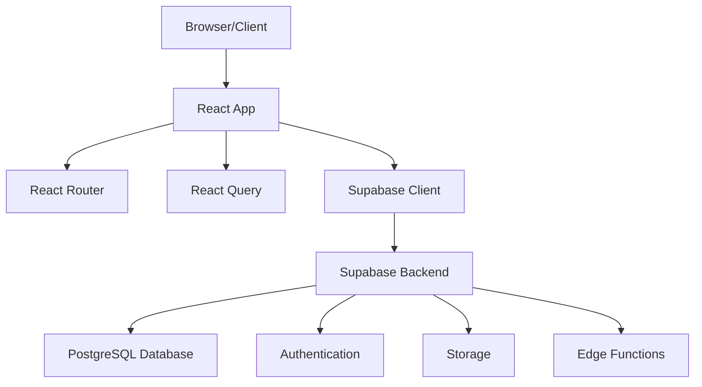

# Architecture Documentation

## System Architecture

### Overview
The donation platform follows a modern React SPA (Single Page Application) architecture with a serverless backend provided by Supabase.



### Frontend Architecture

#### Component Hierarchy
```
App
├── AuthProvider (Context)
├── QueryClientProvider (TanStack Query)
├── TooltipProvider (Shadcn)
├── BrowserRouter
│   └── Routes
│       ├── Index (Landing Page)
│       │   ├── Navbar
│       │   ├── Hero
│       │   ├── CategoryCards
│       │   ├── ProjectCards
│       │   ├── ImpactStoriesSection
│       │   └── Footer
│       ├── ProjectDetail
│       │   ├── ProjectHeader
│       │   ├── ItemNeeds
│       │   ├── ProgressTracking
│       │   └── DonationCTA
│       ├── Projects (Listing)
│       ├── Authentication Pages
│       └── User Pages
├── Toaster (Notifications)
└── Sonner (Toast Notifications)
```

#### Data Flow
1. **User Interaction** → Component Event Handler
2. **API Call** → React Query Hook
3. **Supabase Client** → Database/Auth Service
4. **Response** → React Query Cache
5. **UI Update** → Component Re-render

### State Management Strategy

#### React Query (TanStack Query)
- **Purpose**: Server state management, caching, synchronization
- **Usage**: API calls, data fetching, background updates
- **Configuration**: Global QueryClient with default options

#### React Context
- **AuthContext**: User authentication state, login/logout functions
- **Scope**: Application-wide authentication state

#### Local Component State
- **useState**: Form inputs, UI state, temporary data
- **useReducer**: Complex state logic (not currently used)

### Backend Architecture (Supabase)

#### Database Schema
```sql
-- User Profiles
CREATE TABLE profiles (
  id UUID PRIMARY KEY DEFAULT gen_random_uuid(),
  created_at TIMESTAMP WITH TIME ZONE DEFAULT NOW(),
  updated_at TIMESTAMP WITH TIME ZONE DEFAULT NOW(),
  first_name TEXT,
  last_name TEXT
);

-- Row Level Security Policies
CREATE POLICY "Users can view own profile" ON profiles
  FOR SELECT USING (auth.uid() = id);

CREATE POLICY "Users can update own profile" ON profiles
  FOR UPDATE USING (auth.uid() = id);

CREATE POLICY "Users can insert own profile" ON profiles
  FOR INSERT WITH CHECK (auth.uid() = id);
```

#### Authentication Flow
1. **User Registration**: Supabase Auth creates user
2. **Profile Creation**: Database trigger creates profile record
3. **Session Management**: Automatic token refresh
4. **Route Protection**: AuthContext provides user state

#### API Integration
- **Supabase Client**: Single instance in `src/integrations/supabase/client.ts`
- **Type Safety**: Generated types in `src/integrations/supabase/types.ts`
- **Error Handling**: React Query error boundaries

### Routing Architecture

#### Route Structure
```typescript
<Routes>
  <Route path="/" element={<Index />} />
  <Route path="/login" element={<Login />} />
  <Route path="/signup" element={<Signup />} />
  <Route path="/forgot-password" element={<ForgotPassword />} />
  <Route path="/reset-password" element={<ResetPassword />} />
  <Route path="/project/:id" element={<ProjectDetail />} />
  <Route path="/projects/:id" element={<ProjectDetail />} />
  <Route path="/projects" element={<Projects />} />
  <Route path="/dashboard" element={<MyDonations />} />
  <Route path="/profile" element={<Profile />} />
  <Route path="/about" element={<About />} />
  <Route path="/how-it-works" element={<HowItWorks />} />
</Routes>
```

#### Navigation Patterns
- **Programmatic**: `useNavigate()` hook
- **Declarative**: `<Link>` components
- **Authentication**: Conditional rendering based on auth state

### Component Design Patterns

#### Container/Presentational Pattern
- **Container Components**: Handle business logic, data fetching
- **Presentational Components**: Pure UI components, receive props
- **Example**: ProjectDetail (container) → ItemNeeds (presentational)

#### Composition Pattern
- **Higher-Order Components**: Not used
- **Render Props**: Limited usage
- **Component Composition**: Preferred pattern with children props

#### Custom Hooks Pattern
- **Data Fetching**: React Query hooks
- **Authentication**: useAuth hook
- **Utilities**: useToast, useMobile

### Performance Considerations

#### Current Optimizations
- **React.StrictMode**: Development mode checks
- **Code Splitting**: Not implemented (opportunity)
- **Memoization**: Limited usage (opportunity)
- **Bundle Analysis**: Not configured

#### Optimization Opportunities
1. **Lazy Loading**: Implement route-based code splitting
2. **React.memo**: Memoize expensive components
3. **useCallback/useMemo**: Optimize re-renders
4. **Image Optimization**: Implement lazy loading for images
5. **Bundle Analysis**: Add webpack-bundle-analyzer

### Security Architecture

#### Frontend Security
- **Authentication**: Supabase Auth tokens
- **Route Protection**: AuthContext guards
- **XSS Prevention**: React's built-in protection
- **CSRF Protection**: SameSite cookies (Supabase handles)

#### Backend Security (Supabase)
- **Row Level Security**: Enforced at database level
- **API Authentication**: JWT tokens
- **Data Validation**: Database constraints + frontend validation
- **Rate Limiting**: Supabase default limits

### Error Handling Strategy

#### Current Implementation
- **React Query**: Automatic error states
- **Toast Notifications**: User feedback
- **Console Logging**: Development debugging

#### Improvement Areas
1. **Error Boundaries**: Catch React component errors
2. **Global Error Handler**: Centralized error logging
3. **User-Friendly Messages**: Better error communication
4. **Retry Logic**: Automatic retry for failed requests
5. **Offline Support**: Handle network failures gracefully